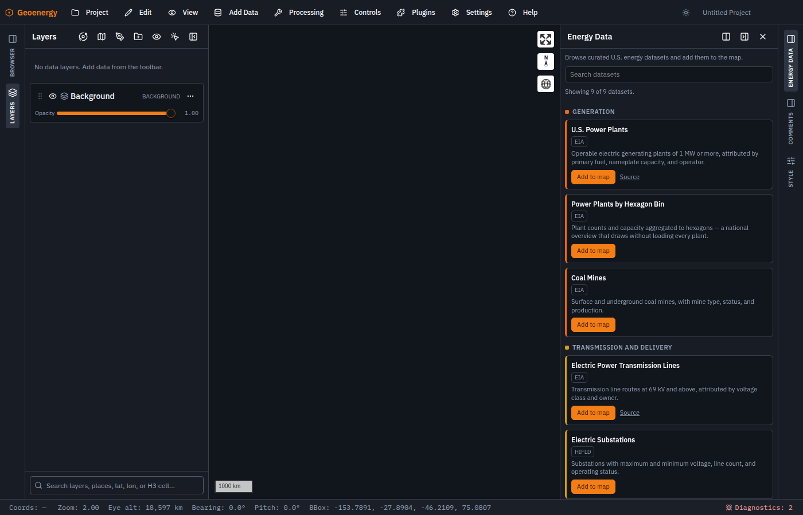

# Geoenergy

An interactive browser for U.S. energy data: where power is generated, how it
moves, where the fuel comes from, where the new load is going, and where the
grid fails.

**[Open the map](https://andyzxm.github.io/geoenergy/)**



## What it is

Most energy datasets live in a portal that will hand you a zip file. Geoenergy
puts them on one map, already projected, already styled, ready to query, and
adds the spatial analysis on top: buffers, overlays, nearest-neighbor, zonal
statistics, attribute queries, and time series, all running in the browser with
nothing to install.

Open the **Energy Data** panel, click a dataset, and it becomes an ordinary map
layer: style it, open its attribute table, run analysis against it, export it,
or save the whole workspace as a project file.

## The catalog

| Group | Datasets |
| --- | --- |
| Generation | Power plants (points and hexbins), coal mines |
| Transmission and delivery | Transmission lines, substations |
| Demand | Data centers |
| Fuels and pipelines | Natural gas, crude oil, petroleum products |
| Reliability and vulnerability | County outage summaries (EAGLE-I) |

Sources are EIA, HIFLD, and ORNL. Every entry links back to its publisher, and
`npm run check:catalog:net` probes each service so a layer that has moved shows
up before a demo does.

The catalog is a JSON file, not code, so adding a dataset is an edit and a push.
See [docs/geoenergy-catalog.md](docs/geoenergy-catalog.md).

## Running it locally

```bash
npm install
npm run dev          # http://localhost:5173
npm run build        # production build
npm run check:catalog
```

Node 22 or newer. Pushing to `main` deploys to GitHub Pages automatically.

## Built on GeoLibre

Geoenergy is a fork of [GeoLibre](https://github.com/opengeos/GeoLibre) by
Qiusheng Wu, MIT licensed. GeoLibre supplies the map engine, the cloud-native
format support (GeoParquet, PMTiles, FlatGeobuf, COG), the DuckDB-WASM query
layer, and the processing toolbox. Geoenergy narrows it to one subject and adds
the dataset catalog.

The desktop, mobile, Jupyter, and R targets, the collaboration and tile workers,
and the store packaging have all been removed here. What remains is the web app.
Upstream releases can still be merged in with `git fetch upstream`.

Data belongs to its publishers. The code is MIT; see [LICENSE](LICENSE).
